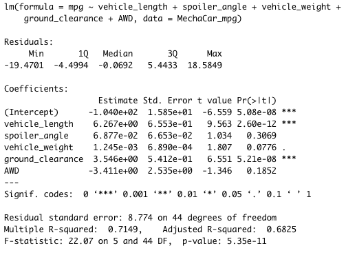
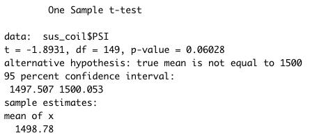
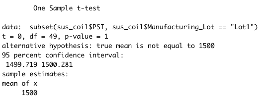
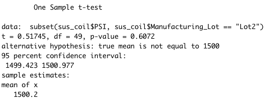
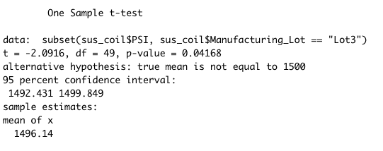

# Mechacar Statistical Analysis

## Linear Regression to Predict MPG

* The variables that provided a non-random amount of variance to the mpg values are the intercept, vehicle length and ground clearance.  The extremely small values for Pr(>|t|) for these variables indicates that they are statistically unlikely to provide random amounts of variance to the linear model.
* The slope of the linear model is not considered to be 0 because the p-value is much smaller than our assumed significance level of 0.05%.  This means theres is sufficient evidence to reject the null hypothesis which meant the slope of the linear model is not 0.
* Since the the Multiple R squared value is relatively high, we could consider that this model would predict mpg of MechaCar prototypes pretty effectively.

## Summary Statistics of Suspension Coils

Although the variance o fthe suspension coils for all manufacturing plants is significanly below the maximum of 100 pounds per square inch, the individual lot data paints a different story.  Lots 1 and 2  don't exceed a variance of 10 pounds per square inch while Lot 3 is extremely high with 170 pounds per square inch.  This means a very high proportion of the variance for all manufacturing plants came for 1 with an etremely high variance that skewed the results.  While Lots 1 and 2 are safe, Lot 3 needs an upgrade.

## T-Tests on Suspension Coils

* The p-value generated from using t.test() to test if the true mean PSI across all manufacturing lots is statistically different from the population mean of 1,500 pounds per square inch was 0.0603.  This is above the significance level of 0.5%, so there isn't sufficent evidence to reject the null hypothesis meaning the true mean of all manufacturing plots is 1,500 pounds per square inch.

* The p-value generated from using t.test() to test if the true mean PSI for Lot 1 is statistically different from the population mean of 1,500 pounds per square inch was 1.  This is above the significance level of 0.5%, so there isn't sufficent evidence to reject the null hypothesis meaning the true mean of all manufacturing plots is 1,500 pounds per square inch.

* The p-value generated from using t.test() to test if the true mean PSI for Lot 2 is statistically different from the population mean of  1,500 pounds per square inch was 0.607  This is above the significance level of 0.5%, so there isn't sufficent evidence to reject the null hypothesis meaning the true mean of all manufacturing plots is 1,500 pounds per square inch.

* The p-value generated from using t.test() to test if the true mean PSI for Lot 3 is statistically different from the population mean of 1,500 pounds per square inch was 0.06417.  This is below the significance level of 0.5%, so there isn't sufficent evidence to reject the null hypothesis meaning the true mean of all manufacturing plots is not 1,500 pounds per square inch. Since the high for the 95% confidence interval is just below 1,500, the true mean should be lower that 1,500.  The Sample estimate mean is 1496.

## Study Design: MechaCar vs Competition
For a statistical test to compare how MechaCar performs compared to the competition, I would focus on maintenance cost.  Typically, maintenance cost differes strongly based on the make of the car.  Since maintenance costs can be the most expensive part of owning a car (tied with gas depending on the make). I would use a 2 sample t.test() to compare the data for each make to test if the true difference between means is not 0.  Depending on the result, this could indicate which make performs better or if there is a difference. Ideally, I would also test fuel efficiency the same way.  If one make got better results for both tests, then i would advise going with that make.
